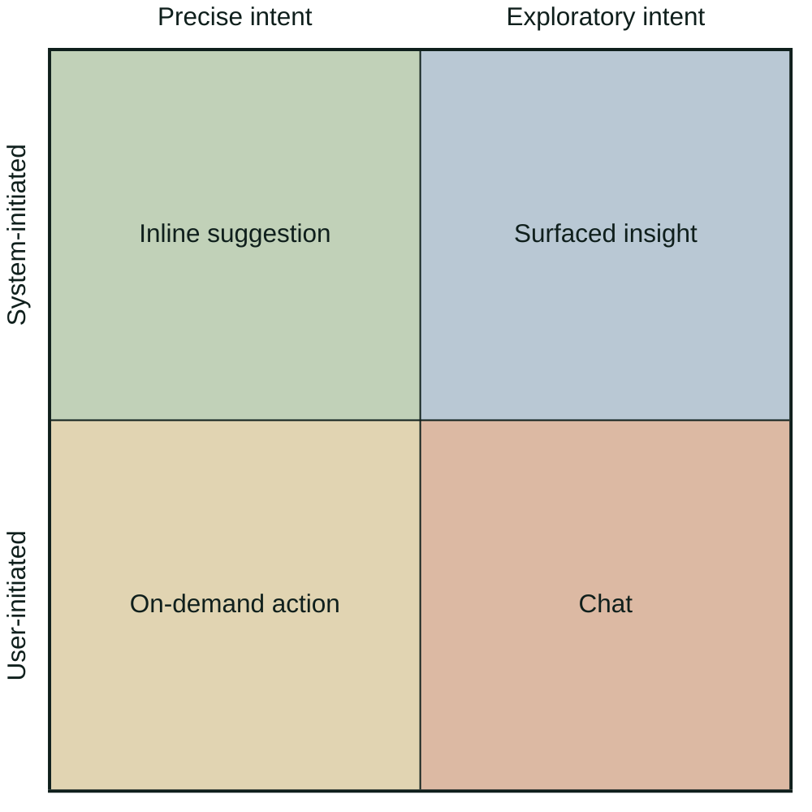

Chat has become the default AI interface across B2B SaaS, and for most use cases it's the wrong one. A CPO at a B2B listings management platform told me something recently: buyers ask "Do you have AI?" when what they mean is "Do you have a chat window?" Teams build the widget to answer that question, and most of the time the same LLM embedded in the actual workflow would serve users better.

<!-- more -->

## Why every team reaches for chat

Chat didn't become the default by accident. Investors and enterprise buyers ask about AI strategy, and a chat window is the fastest thing a team can ship that checks the box.

It also reads as AI in a way a summary panel or a flagged risk does not. A chat bubble with a streaming response is unambiguously an LLM, while the more integrated features could be powered by classic ML, rule-based logic, or a heuristic a developer wrote ten years ago.

The deeper constraint is structural. Most B2B SaaS products have core workflows built on years of legacy code, and AI work often lands with a new hire or a separate team rather than the platform engineers who own those systems. Bolting on a widget is faster and safer than reworking the main flow, which is why so many teams ship the disconnected version and stop there.

## Where chat actually fits

Which interface fits an AI feature depends on two things: whether the user's intent is precise or exploratory, and whether the action is ideally initiated by the user or by the system. Crossing those axes gives four options: on-demand actions, inline suggestions, surfaced insights, and chat.

On the user-initiated row, on-demand actions handle precise tasks (like a "Summarize" button on an email), while chat handles exploratory ones. On the system-initiated row, inline suggestions sit inside precise work like a Copilot ghost-text completion, and surfaced insights flag things the user hadn't thought to look for, like a potential risk in a contract.

Chat is one of those four, and most B2B SaaS work sits in the other three.

The typical B2B task is precise and repeatable: a support agent drafting a reply to an incoming ticket, or a sales rep generating a follow-up email from CRM contact history. The user knows what they need, the task has a predictable shape, and it happens often enough that small amounts of friction add up fast.

Forcing precise tasks through a conversational interface [adds cognitive load without adding value](https://doi.org/10.1016/j.chb.2021.107093). A 2022 study in *Computers in Human Behavior* compared chatbot and menu-based interfaces and found chatbots produce lower perceived autonomy, higher cognitive load, and lower user satisfaction. 

Chat carries the same friction into any precise-intent task that a structured surface could handle instead. When the action happens several times a day, every invocation puts the user through the same sequence: retype the same request in natural language, make sure the chat has the right context for this specific case, read the output carefully to check it matches what they asked for, and make sure they can apply it properly back into the workflow. A button on the record skips all of it: the request is baked into the button, the context is the record itself, and the output lands in a predictable place and format.

A separate chat widget for a precise-intent task is itself a diagnosis. Its existence means the main workflow can't answer the user's question where the work happens, so the user has to leave the flow and go ask for help.

## How chat fails in practice

Chat comes with five main failure modes. Two are inherent to its core design and are reasons to pick a different interface. The other three are common defaults of raw chat that can be engineered away.

**The empty text box.** Open a chat and you see a blank input field, maybe a placeholder that says "How can I help?" Suggestion chips and starter prompts help first-time users get going, but they can't close the gap. If the suggestions were exhaustive, you'd just have the user select one of them instead of writing in a chat window. Since they aren't, a chat's value over a menu is the flexibility to ask for anything outside the listed examples. The same flexibility that makes chat more than a menu also means that users inherently can't know the full set of things the system can do.

A [CHI 2025 study from CMU, MIT, and Microsoft Research](https://dl.acm.org/doi/10.1145/3706598.3714002) measured the onboarding side on programming tasks. Without proactive suggestions, participants reported being unsure what to ask for. With proactive, context-aware suggestions, they passed 12-18% more test cases. Guidance helps, but it can only cover what the product team anticipated users would ask.

**The blind spot.** A chat window can do many things, but the user has to already know there's something worth asking about. In B2B SaaS, some of the highest-value LLM applications are proactive: flagging unusual language in a contract before a reviewer reads it, auto-drafting a reply in the compose window when a support agent opens a new ticket, or generating a summary of action items at the top of a long thread. Chat is reactive by design, waiting for the user to initiate.

If the AI's value is in surfacing things the user didn't think to look for, a chat interface is fundamentally the wrong pattern. [Adobe and CMU researchers evaluating Adobe Experience Platform's AI Assistant](https://arxiv.org/abs/2412.10933) tested this directly. Across 250 real enterprise interactions, evaluators preferred proactive, context-aware suggestions over reactive chat in every aspect. Discoverability showed the widest gap, with 33.4% of evaluators favoring the proactive system versus 23.2% favoring reactive chat. Users find more of a system's capability when it surfaces options instead of waiting to be asked.

The other three failure modes apply even when chat is the right call:

**The wall of text.** Ask a specific question and you'll get four paragraphs back: no summary, and no way to scan for the one sentence that matters. Conversational interfaces have no spatial constraints, so they fill the space. The AI is being thorough, but the user wanted a quick answer, not a lecture. Deliver the same information as a highlighted suggestion, a structured card, or an inline annotation, and it lands completely differently. Even inside chat, structured outputs (tables, cards, bullet summaries, collapsible sections) can replace unconstrained prose.

**The memory mismatch.** Chat sessions build a conversation history, but neither the user nor the model has a clear view of what's actually in scope. Sometimes the model carries all previous turns and gets distracted even after the user's intent has shifted: ask for one thing, realize halfway through you need a different angle, and the model keeps following old instructions instead of starting fresh. Other times the implementation silently truncates or summarizes older turns, so when the user refers back to something from earlier, the model has no memory of it. Both failures come from the same place: the model doesn't know what's still relevant, and the user doesn't know what the model still remembers.

Experienced users learn to work around both, starting new sessions when the model gets distracted and repeating context when it seems to have forgotten. Most users don't, and the interface silently shifts the work of managing session state onto every individual user. Explicit memory scope and a clear "new chat" control address this without leaving chat.

**The confident guess.** When the user's input is vague or hits an edge case the product team didn't anticipate, raw chat answers anyway. The model fills in missing parameters with plausible defaults, commits to an interpretation the user didn't intend, or hallucinates the answer entirely, all delivered with the same confident tone as any correct response. For a precise B2B task, that is worse than no answer: a support agent asking for a reply draft gets something that sounds right but references the wrong ticket, or a sales rep gets a follow-up email built on assumptions they never validated. A clarifying question up front, or a confirmation step before the model commits, trades a small amount of friction for output the user can actually trust.

All five modes come from the same starting point. Teams build AI features in the shape of a general-purpose assistant, because that is the main reference point for what an AI product looks like. A general-purpose assistant starts from a blank text box, produces long prose, waits to be asked, carries every earlier turn forward, and answers ambiguous input rather than asking to clarify. Apply that pattern to a specific B2B task with a predictable shape, and the five failures appear.

## What working teams build instead

The B2B products where AI adoption actually works share a pattern: chat is a fallback for ambiguous tasks, not the primary interface. The teams behind them match the interface to the task.

Notion AI is the clearest example. It launched in alpha as inline `/ai` commands inside blocks (Summarize, Continue writing, Brainstorm) in November 2022, the same month ChatGPT launched, and "Ask Notion" chat didn't arrive until November 2023 as a complement rather than a replacement. The inline interface works because writing or editing a document is a precise-intent task: the user knows what they want to do next, and a chat window would force them to copy their text out, describe the task in natural language, wait for a response, then paste the result back. Inline commands skip that entirely.

Notion scaled on that design. By 2025 it had crossed $500M in ARR, with [over half of its customers paying for AI features](https://www.cnbc.com/2025/09/18/notion-launches-ai-agent-as-it-crosses-500-million-in-annual-revenue.html), up from 10-20% the year before. The approach generalizes: meet users inside their existing workflow, and add chat later as a complement for open-ended tasks. When a more direct surface exists for the common action, chat as the primary interface adds friction without adding capability.

For teams with chat already in production, the move is incremental rather than a rewrite. Check analytics on the one or two highest-volume requests users ask the chat widget, the ones where they already know what they want, and build the inline version of those first. Leave chat as the fallback for genuinely ambiguous work and for cases the inline surface doesn't cover yet. Shipping one task at a time adds up faster than a rebuild and gives users something better before the full pattern is in place.

## How to apply this to your feature

Product-journey fit is one dimension of the [maturity framework I use for diagnosing AI features](ai-feature-maturity-ladder.md), and usually the first place to look when adoption stalls. The 2x2 above describes the four interface options, and the most useful reframe on top of it is to ask what the workflow looked like before AI. If users were typing and clicking through it, the AI should integrate into those actions. If they were searching or asking colleagues for help, a conversational interface is a natural extension. The task that existed before AI should shape the interface, not the technology powering it.

I recently ran this diagnosis on a SQL tooling product's AI assistant and four of the failure modes above were live in the same feature. The inline AI surface was a generic "How can I help?" text box with no predefined actions such as Explain, Optimize, or Fix, so users had to type their intent every time even for repetitive tasks. The assistant didn't surface anything on its own either: no warnings for queries about to scan a full table, no hints for WHERE clauses without usable indexes. When it did respond to an optimize prompt, its most useful output (the index recommendations) sat at the bottom of a long response, below paragraphs of setup the user had to read through first. And the clarifying questions the model actually needed appeared at the very end, meaning the recommendations above were built on guesses the user never got to correct.

The fix on all four is structural: Replace the empty text box with predefined actions (Explain, Optimize, Fix error) for repeat tasks with a known shape. Surface the high-value warnings (table scans, missing indexes) inline as annotations on the query itself. Render the index recommendations as their own UI element at the top of the response rather than paragraphs buried inside it. When the prompt is ambiguous, surface clarifying questions before the model commits to an answer, so the recommendations build on what the user actually meant. A thumbs up/down control closes the loop so the team sees which formats land and can iterate without guessing.

The CPO's buyers asked "do you have AI?" and meant "do you have a chat window?" A chat widget built to answer that question is usually the one nobody adopts. Teams that avoid that outcome start by asking where in the workflow the AI actually provides value. The interface choice naturally follows from that answer.

If the chat widget has to stay for buyer optics or investor demos, leave it in place. Build the inline surface underneath, so the users who actually do the work have something better to reach for.

-   :material-magnify:{ .lg .middle } Shipped an AI feature that isn't landing?

    ---

    I run an AI Feature Audit that evaluates your feature across five dimensions: Product-Journey Fit, UX and Trust, Output Quality, Measurement and Feedback, and Ops and Ownership. Interface fit is often the first bottleneck, but it is rarely the only one. You get a findings report with a maturity score, prioritized fixes, and an advancement roadmap, plus a walkthrough session with your team.

    [Book Free Intro Call :material-arrow-top-right:](https://calendly.com/alfred-persson/intro){ .md-button .md-button--primary }

