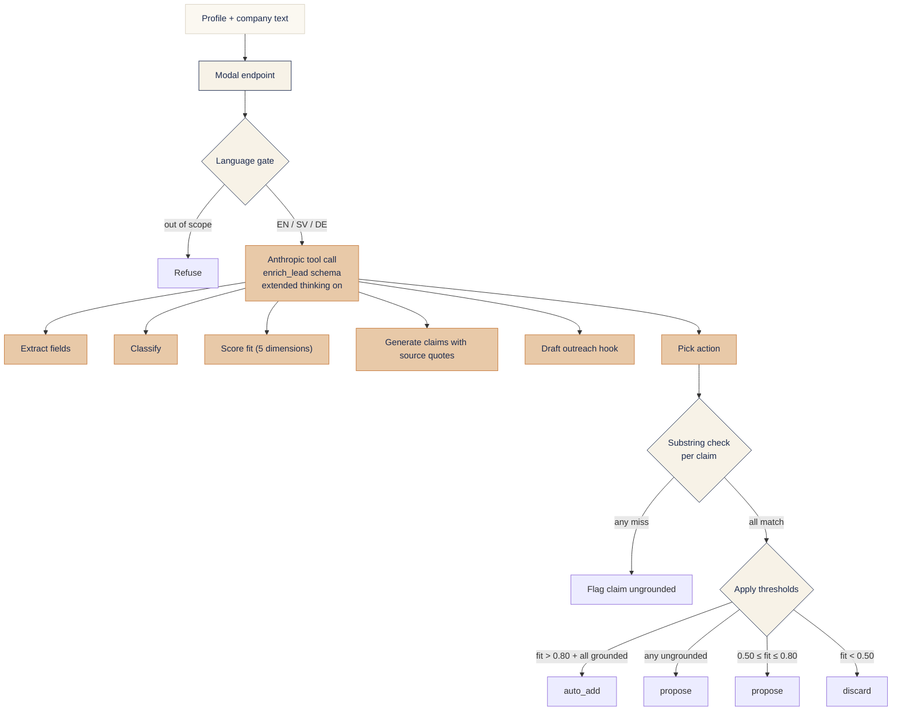

# Integrated vs Chat AI Feature

!!! abstract "Case Study Summary"
    **Type**: Personal project / portfolio piece
    **Stack**: Next.js, TypeScript, shadcn/ui, Python on Modal, Postgres on Neon (pgvector), Anthropic Sonnet 4.6, Voyage-3 embeddings, GitHub Actions
    **Live demo**: [demo.alfredpersson.com](https://demo.alfredpersson.com/)
    **GitHub**: [alfredpersson/lead-enrichment-eval](https://github.com/alfredpersson/lead-enrichment-eval)

    **Focus**: Two builds of the same workflow against the same eval set, model held constant. Surfaces what an integrated, schema-bound, claim-grounded design actually delivers over a well-prompted chat.

    **Headline numbers** *(73-item test set, Sonnet 4.6 both modes)*: action accuracy 80.8% vs 64.2% · substring grounding 99.3% vs 93.4% · classification accuracy 61.6% vs 47.8% · latency p50 30.98s vs 19.66s

## Overview

Most B2B SaaS teams ship AI features as a chat widget. The widget is fast to build, looks like AI, and answers the buyer question "do you have AI?" with one yes. The harder design question is whether chat is the right shape for the workflow underneath. This demo answers the question on a concrete task by building the same workflow twice and putting both surfaces on the same scoreboard.

The task is sales lead enrichment. A user pastes a profile and a company description; the system extracts structured fields, classifies the lead, scores fit against a fixed B2B SaaS ICP, generates source-quoted claims, drafts an outreach hook, and recommends an action (auto-add, propose, discard, or refuse). Two builds run that workflow:

- The **integrated build** runs Sonnet 4.6 through a strict `enrich_lead` tool schema, with extended thinking on a 4,000-token budget and a hard rule that every claim must cite a verbatim source quote from the input.
- The **chat build** runs the same Sonnet 4.6 with a task-describing system prompt and the ICP as context. No tools, no schema, no grounding rule. Multi-turn streaming chat with a Haiku 4.5 extractor pulling structured fields from the response for scoring.

Both surfaces are productized to the same standard: lead queue, paste composer, status pills, themed palette, in-product diagnostics. The asymmetry sits at the model-side contract, not at the UI. That is what the scorecard measures.

## The two builds, side by side

| Dimension | Integrated | Chat |
|---|---|---|
| Output contract | Strict `enrich_lead` tool schema | Free-form prose |
| Grounding rule | Per-claim verbatim source quote | No structural requirement |
| Inference shape | Single structured call | Multi-turn chat + Haiku extractor |
| Extended thinking | 4,000-token budget | Off |
| Model | claude-sonnet-4-6 | claude-sonnet-4-6 |

The chat build is not a strawman. Same model, same polish, same prompt care. What it lacks is the model-side contract: there is no tool the model can call, no schema the output must conform to, no enforced grounding rule. The scorecard reports where that absence shows up and where it does not.

## How the integrated build runs

The whole chain happens inside one structured tool call. Extended thinking gives the model space to reason about ICP fit before committing to a fit score; the schema forces every output field into a known shape; the substring check is deterministic, not judge-mediated. The action threshold is read off the fit score and the grounding state, not asked of the model.

The chat build runs the same model with a task-describing system prompt and lets the model produce free-form prose. A Haiku 4.5 extractor pass runs at eval time only to pull structured fields out of the response so chat and integrated outputs can be scored against the same gold labels.

## What the scorecard measures

73 hand-labelled items: 30 synthetic B2B SaaS profiles, 20 adversarial cases (prompt injections, jailbreak attempts, contradictory data, sparse input, multilingual injection), 13 edge cases, plus the 5 pre-loaded exemplars seeded in both UIs. Gold values: structured fields, classification, a 0.0–1.0 fit score with five named dimensions, the claims a hook may use with verbatim source quotes, and the expected action.

The metrics split into three tiers. The deterministic block carries the credibility weight, the judged block is reported but flagged as second-tier, and the robustness pass tests perturbed inputs.

**Deterministic.** Classification accuracy per field. ICP fit correlation (Pearson and Spearman). Action accuracy. Refuse-when-should. Substring grounding (does the claim's `source_quote` appear verbatim in the input). Steps-to-completion (one tool call for integrated, capped at three turns for chat with the extractor pass deciding completeness). Latency and token cost.

**Judged.** Claim grounding judged by Claude Opus 4.7 and GPT-5 in parallel; the conservative lower-of-two rates is the headline. Hook coherence on a binary pass/fail rubric judged by GPT-5-mini. Cohen's kappa between Opus and OpenAI judges is reported every run so judge drift is visible.

**Robustness.** Three perturbation variants per item: typos, sentence reorder, and an appended injection probe. The reported drop is in classification accuracy and substring grounding rate versus the main pass.

## Headline numbers

73-item test set, Sonnet 4.6 held constant across both modes (thinking on for integrated, off for chat). Last run 2026-05-14.

| Metric | Integrated | Chat | Δ |
|---|---|---|---|
| Classification accuracy (per-item) | **61.6%** | 47.8% | +13.9pp |
| Action accuracy | **80.8%** | 64.2% | +16.6pp |
| Fit score, Spearman | **0.78** | 0.75 | +0.03 |
| Substring grounding | **99.3%** | 93.4% | +5.9pp |
| Judge grounding (conservative) | 68.8% | **79.9%** | -11.1pp |
| Hook pass rate | 68.1% | **84.5%** | -16.4pp |
| Latency p50 | 30.98s | **19.66s** | +11.32s |

The integrated build wins where the contract bites: action accuracy, classification, substring grounding, fit-score correlation. The chat build wins where free-form prose has the advantage: hook quality on a binary judge rubric, judge-grounding by the looser semantic definition, and p50 latency because it does not run extended thinking. The point of the scorecard is not that integrated wins everywhere. It is that the wins and losses are predictable from the contract, measurable on the same set, and visible side by side.

## The eval-and-fix loop

A static scorecard demonstrates the ability to measure quality. It does not demonstrate the ability to ship, measure, diagnose, and fix. The scorecard surfaces one dated incident where an eval-pass failure was diagnosed and a shipped fix moved the affected metric, with both pre-fix and post-fix snapshots committed.

**2026-05-13 · `classification.industry`.** First full eval showed the integrated build's industry classification correct on 24/73 items (32.9%). The tool schema declared `industry` as a free-form string and the system prompt provided no canonical vocabulary, so the model emitted semantically-right-but-strictly-wrong labels ("SaaS", "B2B Software") instead of the gold's "B2B SaaS". The fix added an 8-value enum to `industry` on the `enrich_lead` tool schema (verbatim gold vocabulary plus "Insufficient signal" as the catch-all) and a one-line system-prompt instruction naming the catch-all. The chat build was not modified; the chat-side lift (38.2% → 88.3%) is a methodology effect because the Haiku extractor shares the same tool schema. Integrated landed at 94.5%.

The interesting part is the shape of the fix, not the lift. The vocabulary failure was invisible at the prompt level and only surfaced once the gold labels were strict. That is the kind of finding the eval harness is built to catch.

## What changes for production

This is a portfolio demo, not a production system. The shapes that change between this demo and a real deployment:

| Area | Demo | Production |
|---|---|---|
| Input trigger | Paste in browser | CRM record trigger, browser extension on LinkedIn, CSV bulk import |
| ICP | Fixed, declared on `/methodology` | Customer-supplied, structured or hybrid CRM-linked, anchored rubrics calibrated against the customer's pipeline |
| Eval cadence | Manual via GitHub Actions `workflow_dispatch` | PR regression gate on the anchor subset, full eval on schedule, alerting on metric drift |
| Telemetry | Funnel signals on the demo, no real adoption data | Per-user adoption metrics, time-to-action, override rate, action accuracy on confirmed leads |
| Persistence | None server-side, localStorage for chat | Per-account history, audit log, retention policy aligned with customer agreement |
| Languages | EN / SV / DE | Customer-driven; gold-labelling repeated per added language |

The eval harness, the structured-tool-with-substring-grounding pattern, and the dated regression-and-fix loop are the parts that travel directly to a client engagement. The fictional ICP is the part that is replaced.

## Tech stack

| Layer | Tech | What it does |
|---|---|---|
| Frontend | Next.js (App Router), TypeScript, shadcn/ui, custom theme | Two product surfaces against the same backend, themed in cream / navy / amber to match alfredpersson.com |
| Backend | Python services on Modal | `enrich_lead` for integrated, chat completion endpoint for chat, embedding similarity lookup |
| Database | Postgres on Neon with pgvector, pooled connection (PgBouncer transaction mode) | Telemetry rows, eval set with embeddings, eval-run snapshots |
| LLM | Anthropic Sonnet 4.6 (live, both modes), Haiku 4.5 (chat extractor at eval time) | Structured tool use with extended thinking on integrated; free-form prose on chat |
| Embeddings | Voyage-3 (precomputed for eval set, live for incoming requests) | Top-3 nearest-neighbour panel in product, similarity-based eval-set lookup |
| Eval harness | Python via Anthropic batch API, GitHub Actions `workflow_dispatch` | Deterministic metrics, two judge models for claim grounding, perturbation suite |
| Judges | Claude Opus 4.7 + GPT-5 (claim grounding, parallel), GPT-5-mini (hook coherence) | Cross-provider judging with Cohen's kappa reported per run |
| Rate limiting | Upstash Redis per-IP token bucket | Demo cost-cap with a daily-limit fallback message |
| Observability | Modal and Vercel logs, Sentry, Vercel Analytics | Cookieless funnel events split into operational vs prospect-funnel layers |
| Deploy | GitHub Actions on `main`, `vercel deploy --prod` + `modal deploy` | Front, back, and eval contract stay in lockstep |

-   :material-coffee:{ .lg .middle } Want this run on your AI product?

    ---

    Shipped an AI product and seeing it behave in production in ways no one designed for? I run an AI Feature Audit that evaluates your build across five behaviour dimensions: Product-Journey Fit, UX and Trust, Output Quality, Measurement and Feedback, and Ops and Ownership. The eval harness that produced this scorecard is the same one I use on client work.

    [Book Free Intro Call :material-arrow-right:](https://calendly.com/alfred-persson/intro){ .md-button .md-button--primary }

