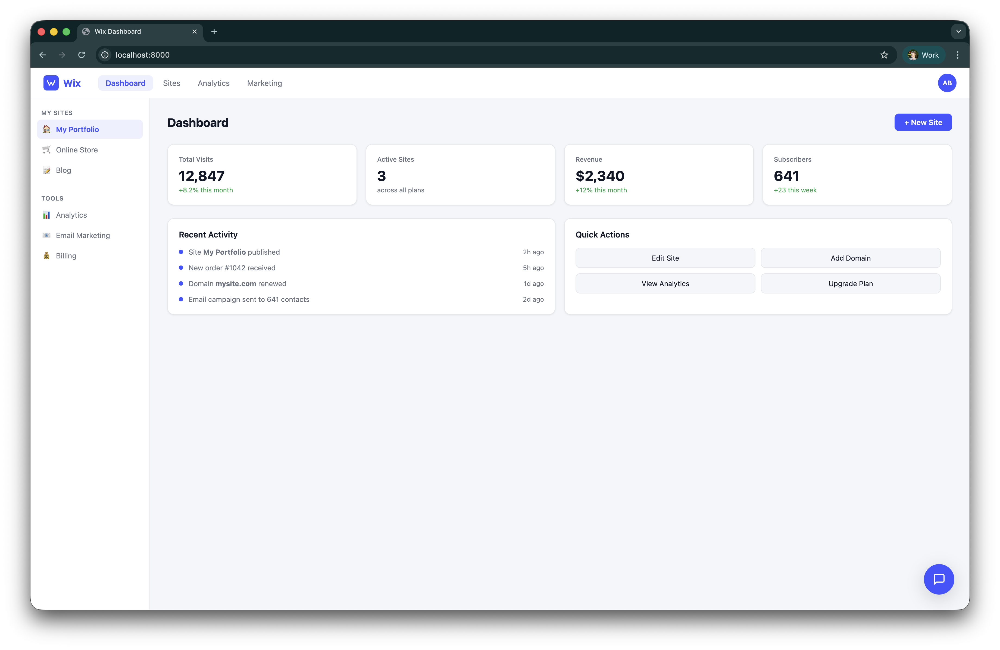
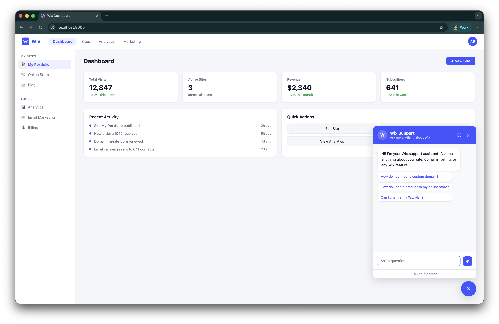
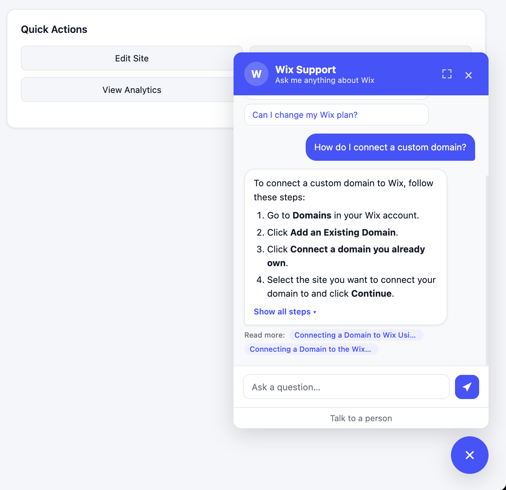
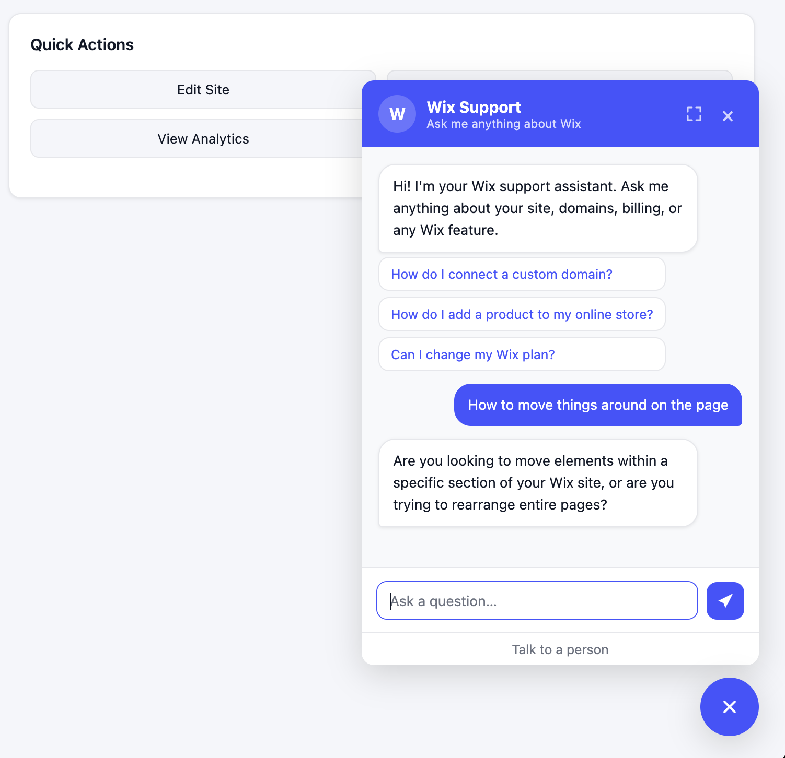
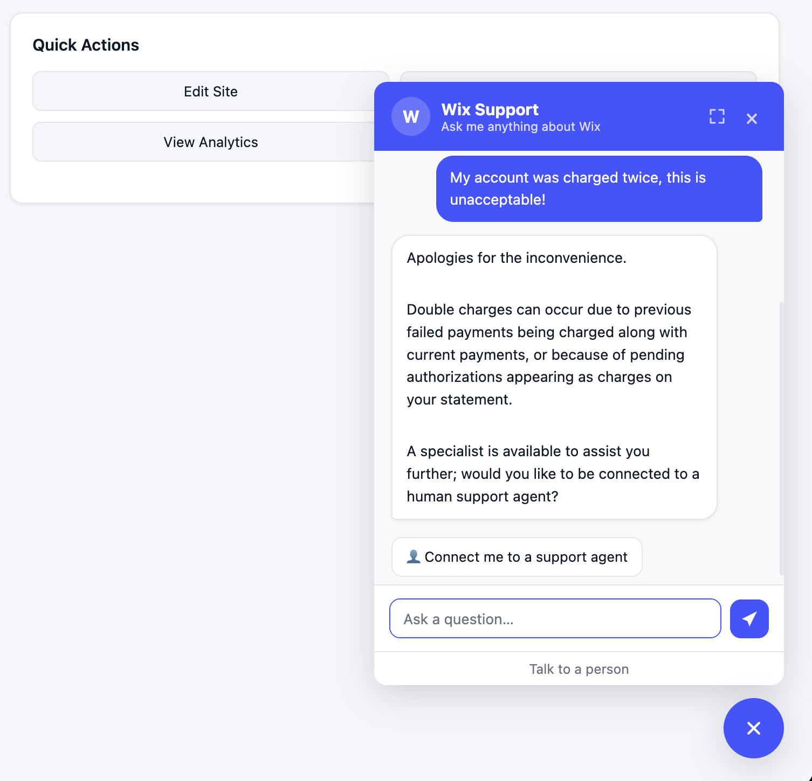
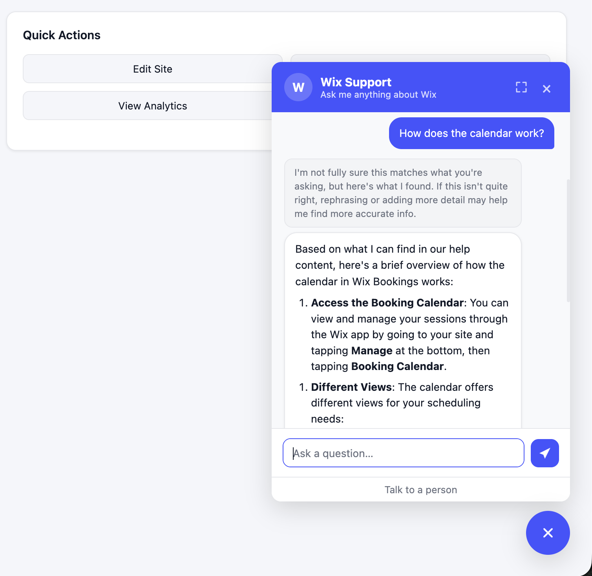
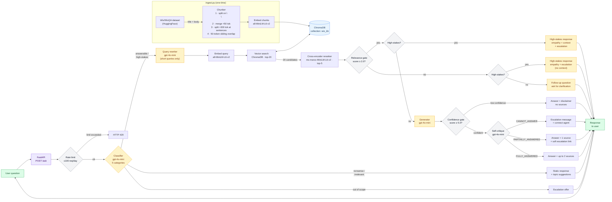

# RAG Support Assistant

!!! abstract "Case Study Summary"
    **Type**: Personal project / portfolio piece
    **Stack**: Python, FastAPI, OpenAI gpt-4o-mini, ChromaDB, sentence-transformers, cross-encoder reranker, pydantic-ai, Langfuse, vanilla JS
    **GitHub**: [alfredpersson/rag-support-assistant](https://github.com/alfredpersson/rag-support-assistant)

    **Focus**: Designing specific failure paths for when retrieval isn't confident, rather than optimizing for maximum accuracy.

    **Evaluation** *(7 experiments, n=200 retrieval / n=50 generation)*: 71% hit rate · 4.80/5 faithfulness · 4.76/5 relevancy

## Video Walkthrough

  <iframe style="position: absolute; top: 0; left: 0; width: 100%; height: 100%; border: 0;" src="https://www.tella.tv/video/vid_cmneo6b35006306jzay6dasfh/embed?b=0&title=0&a=0&loop=0&t=0&muted=0&wt=0&o=0" allowfullscreen allowtransparency></iframe>

## Overview

A customer support RAG pipeline built over the [Wix Help Center dataset](https://huggingface.co/datasets/Wix/WixQA). Every stage (chunking, retrieval, reranking, classification, generation, and evaluation) is implemented from scratch so the design decisions are visible and auditable.

The focus is on what happens when the pipeline *can't* confidently answer: when retrieval returns nothing useful, when the model hedges, or when the user is upset and asking to cancel their account. Each of these cases has a specific, designed response path.

In a support context, a bot that handles a cancellation request the same way it handles a how-to question will lose that customer. A bot that confidently presents a wrong answer erodes trust faster than having no bot at all. So the pipeline is built to deflect tickets when the bot can help, preserve trust when it can't, and route to a human when the situation calls for it.

## Screenshots

The support widget lives in the corner of a mock SaaS dashboard:

### Response types

The widget renders each response type differently based on the pipeline's routing decision:

**Fully answered** — a grounded answer with step-by-step instructions and source article links:

{ width="400" }

**Follow-up question** — when retrieval finds nothing relevant, the bot asks a clarifying question instead of guessing:

{ width="400" }

**High-stakes escalation** — sensitive queries (cancellations, billing disputes) get an empathetic response with a path to a human agent:

{ width="400" }

**Low confidence** — the answer is shown with a disclaimer and no source links:

{ width="400" }

## How it works

Every question is classified into one of five categories (**answerable**, **nonsense**, **irrelevant**, **out-of-scope**, or **high-stakes**) and routed to a purpose-built handler. Only answerable and high-stakes queries go through retrieval; the rest get static responses immediately without wasting compute.

For queries that go through retrieval, the pipeline applies two confidence gates before presenting an answer:

1. **Relevance gate** — if the cross-encoder reranker's top score is below 2.0, the retrieved results aren't good enough. Instead of generating from weak context, the bot asks a clarifying follow-up question.
2. **Confidence gate** — if the top score is below 5.0, the answer is shown but the bot signals that it isn't fully sure and asks the user to be more specific.

After generation, a **self-critique** step assesses whether the answer fully, partially, or cannot address the question. This determines whether to offer human escalation and how much confidence to convey to the user.

**High-stakes queries** (cancellations, billing disputes, complaints) bypass normal generation entirely. They get an empathetic acknowledgment with a structured retention offer and escalation path. A standard RAG answer to "I want to cancel my account" is the wrong response.

## Pipeline

## Failure states

| Situation | Response | Reasoning |
|---|---|---|
| Retrieval finds nothing relevant | Clarifying follow-up question | Avoids hallucinating from weak context; keeps the conversation going |
| Low retrieval confidence (score 2.0–5.0) | Disclaimer above the answer, no source links | Context is good enough to attempt an answer but not good enough to cite confidently |
| Self-critique: CANNOT_ANSWER | "I couldn't find an answer" + connect-to-agent button | Immediate escalation path instead of a vague hedge |
| Self-critique: PARTIALLY_ANSWERED | Answer + 1 source link + soft inline escalation link | Partial answers are still useful — a soft text link gives the user an easy path if the answer isn't enough |
| Self-critique: FULLY_ANSWERED | Answer + up to 2 source links | Confident answer with "read more" links to the full articles |
| High-stakes query | Empathetic acknowledgment + retention offer + escalation | Sensitive queries need tone and structure control, not a help article |
| Out-of-scope query | Escalation offer | Doesn't pretend to help with things it can't handle |
| Nonsense or irrelevant query | Polite deflection + topic suggestions | Saves retrieval and generation compute |

## Evaluation

The pipeline is evaluated against the [WixQA benchmark](https://huggingface.co/datasets/Wix/WixQA) with retrieval and generation scored separately, so failures can be diagnosed to the right stage. 7 experiments were run across retrieval strategy, query expansion, classifier tuning, and chunk enrichment. The best configuration is **title-prepended embeddings + cross-encoder reranking**.

| Metric | Score | What it means |
|---|---|---|
| Expert Hit Rate @ 5 | **0.71** *(n=200)* | The correct help article appeared in the top 5 results 71% of the time |
| Expert MRR | **0.51** *(n=200)* | On average, the correct article appeared around position 2 |
| Faithfulness | **4.80 / 5** *(n=50)* | Answers are almost entirely grounded in retrieved content, not hallucinated |
| Relevancy | **4.76 / 5** *(n=50)* | Answers consistently address what was actually asked |

The 71% hit rate held steady across all seven experiments. The remaining 29% are KB coverage gaps and vocabulary mismatches that retrieval tuning alone won't close. That's exactly the scenario the confidence gates and failure paths above are built for: rather than trying to squeeze more accuracy out of retrieval, the system recognizes low-confidence results and routes them to clarifying questions, disclaimers, or human escalation.

## What changes for production

| Area | Demo | Production |
|---|---|---|
| Vector store | ChromaDB (local file) | pgvector or managed service (Pinecone, Qdrant) |
| Retrieval | Dense only | Hybrid: dense + BM25 with RRF |
| Classification | LLM call (gpt-4o-mini) | Fine-tuned small classifier, <50 ms |
| Evaluation | Offline script, LLM-as-judge on 50 questions | CI-gated regression suite on prompt/retrieval changes |
| Rate limiting | JSON file | Redis `INCR` + `EXPIRE`, per-user |
| Conversation context | Stateless (single turn) | Sliding window stored in Redis, session ID on API |
| Streaming | None | Server-Sent Events, token-by-token |
| Frontend | Vanilla JS widget | React + TypeScript |

## Tech stack

| Layer | Tech | What it does |
|---|---|---|
| Chunking | Paragraph split + merge/split heuristics + 50-token overlap | Breaks help articles into retrievable pieces while preserving natural structure |
| Embedding | `sentence-transformers/all-MiniLM-L6-v2` (local) | Converts text to vectors for similarity search, runs locally with no API cost |
| Vector store | ChromaDB (persistent, local) | Stores and searches article chunks by similarity |
| Reranker | `cross-encoder/ms-marco-MiniLM-L6-v2` | Two-pass search: fast vector scan, then precise re-scoring of top candidates |
| LLM | OpenAI `gpt-4o-mini` via `pydantic-ai` | Generates answers, classifies queries, and self-critiques responses |
| API | FastAPI + CORS + static files | Serves the pipeline and frontend |
| Frontend | Vanilla HTML/CSS/JS chat widget | Renders each response type differently: source links, escalation buttons, suggestion chips |
| Observability | Langfuse (traces + prompt versioning) | Shows exactly what happened on every request |

-   :material-coffee:{ .lg .middle } Let's have a virtual coffee together!

    ---

    Want to see if we're a match? Let's have a chat and find out. Schedule a free 30-minute intro call to discuss your AI challenges and explore how we can work together.

    [Book Free Intro Call :material-arrow-top-right:](https://calendly.com/alfred-persson/intro){ .md-button .md-button--primary }

